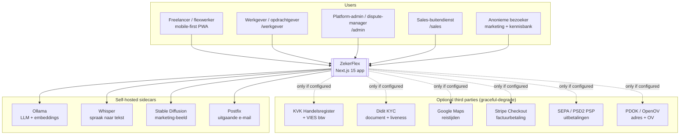
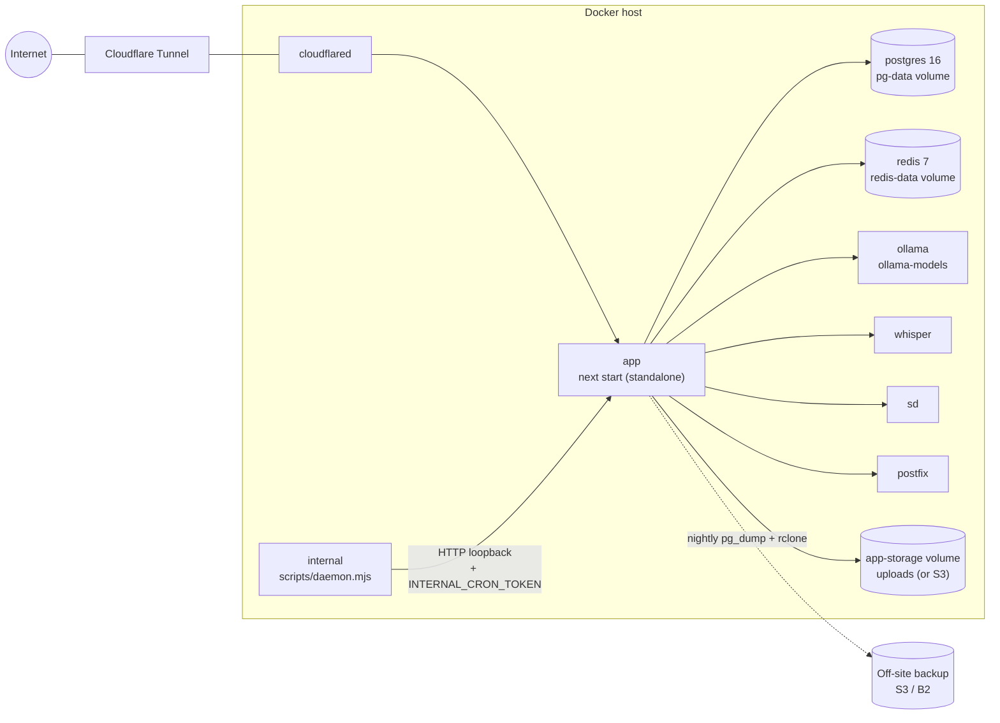
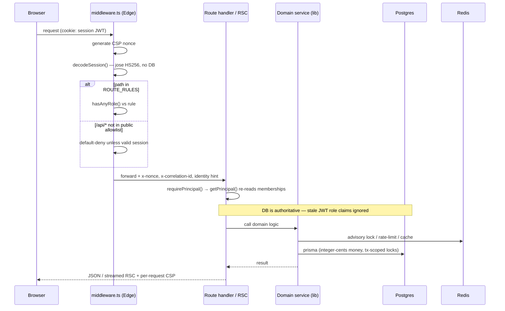
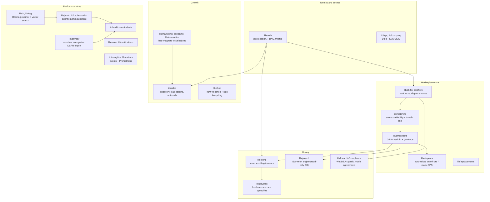
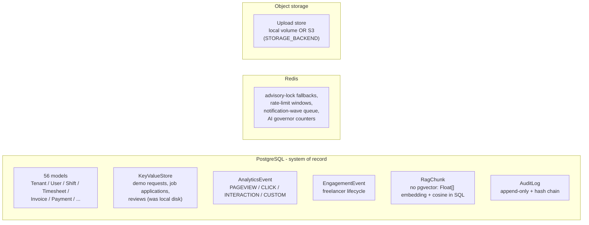
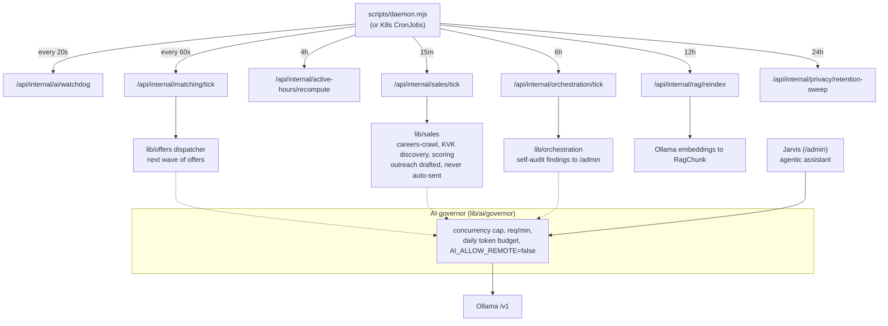

# Architecture

ZekerFlex is a **single Next.js 15 application** (App Router, TypeScript strict)
backed by PostgreSQL and Redis, designed to run **100 % self-hosted** on one
box ("Sovereign Box") behind a Cloudflare Tunnel. Vercel is supported as a
demo/preview target only.

- **56 Prisma models**, one PostgreSQL database.
- **~40 domain modules** under `lib/` (pure logic), thin route handlers under
  `app/api/`, server components for the UI.
- **No external SaaS is required to run** — auth (jose), search/RAG + chat
  (Ollama), analytics, e-mail (Postfix), speech (Whisper), image gen (SD) all
  have a local implementation. Optional third parties (KVK, Didit KYC, Google
  Maps, Stripe, a SEPA PSP) degrade gracefully when unconfigured.

---

## 1. System context

---

## 2. Deployment topology — the Sovereign Box

`docker-compose.prod.yml` — one host, one Docker network, no inbound ports
(Cloudflare Tunnel dials out).

**K8s alternative:** `infra/helm/zekerflex` + `infra/k8s/base` — same containers
as a Deployment + CronJobs, `hostname: zekerflex.nl`, cert-manager TLS.

---

## 3. Request lifecycle

Key invariants:

- **Money** is always integer cents (`Int`), never float.
- **Seat allocation** (offer accept, auto-assign, marketplace apply, free
  replacement) takes `lockShiftSeats()` — a transaction-scoped
  `pg_advisory_xact_lock` — before reading `taken`.
- **Invoice numbers** are gap-free per `(type, year)` via a row-locked counter.
- **Audit log** is append-only with a tamper-evident SHA-256 hash chain
  (`lib/audit-chain.ts`).
- **CSP** `script-src` is `'self' 'nonce-…' 'strict-dynamic'` in prod — every
  route is server-rendered so the nonce is fresh.

---

## 4. Application module map

Each `lib/<domain>` is **pure-ish logic + a Prisma dependency**; `app/api/<x>`
handlers are thin (parse → `requireRole` → call service → shape response).
Cross-cutting: `lib/errors.ts` (`AppError`), `lib/rate-limit.ts`
(`enforceRateLimit`), `lib/http/*`, `lib/logger.ts` (correlation-id bound).

---

## 5. Data stores

- **No data warehouse today.** Analytics reads run directly off the OLTP DB
  (`lib/analytics/report.ts`, `lib/admin/overview.ts`). See
  [DATA-ANALYST-ROADMAP.md](./DATA-ANALYST-ROADMAP.md).
- `directUrl` (`DATABASE_URL_UNPOOLED`) is used for migrations; the app uses the
  pooled URL.

---

## 6. AI & automation layer

Every internal endpoint is `INTERNAL_CRON_TOKEN`-gated and records a
`zf_cron_last_run_*` metric + heartbeat.

---

## 7. Auth & security

- **Session**: `lib/auth/session.ts` mints a plain **jose HS256 JWT** (8 h, or
  30 d "ingelogd blijven"); NextAuth v5-beta is wired to mint/read exactly that
  token via its `jwt.encode`/`decode` hooks — so the Edge middleware verifies
  sessions without Prisma. `AUTH_SECRET_PREVIOUS` allows key rotation.
- **RBAC**: `getPrincipal()` re-reads `Membership` rows on every request → a
  revoked role takes effect immediately; JWT `roles` claims are a hint only.
- **Middleware**: default-deny for any `/api/*` not in the public allowlist;
  role rules for `/dashboard`, `/werkgever`, `/sales`, `/admin`.
- **Headers**: nonce CSP (per request, in middleware), HSTS preload,
  `frame-ancestors 'none'`, Permissions-Policy.
- **Rate limiting**: one `enforceRateLimit()` → 429 + `Retry-After`, keyed
  `rl:<name>:<ip|id>` in Redis.
- **AVG/GDPR**: `lib/privacy` — retention schedule as code, deep
  `anonymizeUser()`, daily sweep, art. 15/20 self-service export. Statutory
  retention (7-yr fiscal) overrides erasure.
- **Audit**: `recordAudit()` → append-only `AuditLog` with a SHA-256 hash chain
  over immutable identity fields (scrubbing PII doesn't break the chain);
  `verifyAuditChain()` + `/api/admin/audit/verify`.

---

## 8. Observability

| Signal | Where |
|---|---|
| Metrics | `GET /api/metrics` (Prometheus, shared-secret) — Node defaults + `zf_*` business counters + cron heartbeats |
| Alerts | `infra/docker/alert.rules.yml` (app-down, cron stale/failing, login-failure spike, 429 spike, payout failures, event-loop lag) |
| Logs | `lib/logger.ts` — structured JSON, correlation-id per request |
| Health | `/api/health` (liveness), `/api/ready` (DB + Redis), `/api/status` (public, per-component + deployment target) |
| Product analytics | `AnalyticsEvent` + `/admin/analytics` + `/admin` Control Center |
| Traces | not yet (OpenTelemetry is a roadmap item) |

---

## 9. What changes on Vercel

- No `next start` — Vercel's own adapter; `output: "standalone"` is ignored.
- The `internal` daemon container is replaced by `vercel.json` `crons`.
- Ollama / Whisper / SD / Postfix are **not available** →
  `deploymentTarget()` returns `vercel-demo` and the UI shows a banner.
- `prisma migrate deploy` runs in `build:with-migrate` against the Vercel
  `DATABASE_URL` (a Neon instance).
- Every route is a serverless function (the nonce CSP already forces dynamic).
