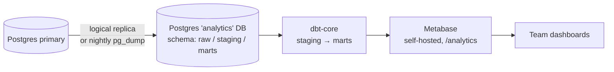

# Data-analyst roadmap

How to turn ZekerFlex's operational database into a decision-making capability —
without breaking the "sovereign, self-hosted, privacy-first" principle.

> **North star:** a weekly number that tells us whether the **marketplace is
> getting more liquid** (shifts fill faster, more freelancers get work, take
> rate holds) — and a funnel that shows *where* demand or supply leaks.

---

## Where we are (Phase 0 — done)

| Capability | Implementation |
|---|---|
| Page / interaction tracking | `AnalyticsEvent` (PAGEVIEW / CLICK / INTERACTION / CUSTOM), cookie-free, `POST /api/analytics/track`, `AnalyticsBeacon` |
| Server-side conversions | `recordServerEvent()` → demo-request, open-application, whitepaper-download |
| Freelancer lifecycle | `EngagementEvent` (kind-tagged) |
| Live + 7-day traffic | `lib/analytics/report.ts`, `/admin/analytics` |
| Ops snapshot | `lib/admin/overview.ts` → `/admin` Control Center, Jarvis context |
| Infra metrics | Prometheus `/api/metrics` + `zf_*` business counters + alert rules |
| Sales pipeline | `SalesLead` (scored), `SalesOutreach` |
| Compliance signals | `DbaComplianceRecord`, `AuditLog` (hash-chained) |

**Gaps:** no event naming standard, no funnel/cohort analysis, all reads hit
the OLTP DB, no historical snapshots (metrics are "now" only), no self-serve
BI, no metric definitions anyone can point to.

---

## Guiding principles

1. **Sovereign** — self-hosted tools only: PostgreSQL (or DuckDB) + **Metabase**
   or **Apache Superset**, **dbt-core**, optional **Redash**. No Snowflake,
   BigQuery, Looker, Segment, GA.
2. **Never touch OLTP performance** — analytics reads run against a **replica**
   or a nightly snapshot, never the primary.
3. **Privacy by construction** — the analytics layer stores *pseudonymised*
   ids and aggregates; raw PII stays in the app DB. Reuse `lib/privacy`
   anonymisation rules. An erased user must disappear from dashboards too.
4. **Definitions live in code** — every KPI has one SQL/dbt definition,
   reviewed like any other PR.
5. **Decisions, not vanity** — each dashboard answers a question someone
   actually asks in a Monday meeting.

---

## Phase 1 — Tracking plan & event taxonomy (weeks 1–3)

**Goal:** every meaningful action emits a well-named event, so funnels are
possible.

- [ ] Write `docs/analytics/TRACKING-PLAN.md`: a table of
      `event_name | trigger | properties | owner`. Names are
      `object_action` snake_case (`shift_published`, `offer_sent`,
      `offer_accepted`, `timesheet_submitted`, `timesheet_approved`,
      `payout_chosen`, `invoice_issued`, `signup_started`, `signup_completed`,
      `kyc_completed`).
- [ ] Extend `recordServerEvent()` usage to the money/marketplace path
      (currently only marketing conversions are instrumented server-side).
      Emit from the domain services, not the routes.
- [ ] Add a typed `analyticsEvent(name, props)` helper + a union of allowed
      names so a typo fails `tsc`.
- [ ] **Add status-transition timestamps** where they're missing — e.g.
      `Shift` only has `createdAt` today, so "time to publish" and "time to
      fill" can't be measured precisely. Add `publishedAt` / `filledAt` (or a
      generic `ShiftStatusChange` log).
- [ ] Backfill: derive historical events from `Shift`, `ShiftMatch`,
      `Timesheet`, `Invoice`, `Payment` state + timestamps (one migration
      script) so funnels have history from day 1.
- [ ] Session stitching: link the pre-auth `sessionId` to `userId` on signup
      (store the first-touch session on `User` or an `AttributionEvent`).

**Deliverable:** a funnel query that works — visitor → signup → KYC → first
application → first assignment → first approved timesheet → first payout.

---

## Phase 2 — Analytics store & BI (weeks 3–7)

**Goal:** a place to run heavy queries and a tool non-engineers can use.

- [ ] Stand up a **read replica** (`docker-compose`: a second Postgres with
      streaming replication) *or*, if that's heavy, a nightly
      `pg_dump | pg_restore` into an `analytics` database on the same box.
- [ ] Add **Metabase** as a compose service behind the tunnel
      (`analytics.zekerflex.nl`, its own auth, read-only DB user).
- [ ] Create a **pseudonymisation view layer**: `analytics.dim_user` exposes
      `user_key = sha256(user_id || salt)`, `badge_level`, `city_bucket`,
      `created_week` — **no name, e-mail, phone, KVK, IBAN**.
- [ ] Nightly **snapshot job**: append today's marketplace KPIs to a
      `fact_daily_kpis` table so trends survive (metrics are "now" only today).
      Reuse the daemon (`/api/internal/analytics/snapshot`).
- [ ] Wire an erasure hook: `anonymizeUser()` also nulls the analytics
      `dim_user` row / re-buckets it.

**Deliverable:** Metabase up, one "Marketplace health" dashboard, definitions
in `analytics/models/`.

---

## Phase 3 — Core metrics & dashboards (weeks 6–10)

Build these four dashboards. Definitions in the appendix.

### 3a. Marketplace liquidity

- Fill rate (filled shifts / published shifts), by week, branch, klustype.
- Time-to-fill (publish → last seat taken), p50/p90.
- Offer funnel: sent → viewed → accepted → assigned, with drop-off per wave.
- Supply/demand ratio: available freelancers vs open positions, by city + day.

### 3b. Money & unit economics

- GMV (billable hours × rate), take rate (€3,50 fee / GMV), net revenue.
- Payout-speed mix (instant 4 % / 3-day 2 % / free) and fee income from it.
- Invoice → paid conversion + days-to-pay; failed-payment rate.
- Contribution margin per shift (fee − payout-processing − support cost).

### 3c. Supply health (freelancers)

- Activation funnel: signup → KYC → first application → first shift.
- Cohort retention: % of a signup-week cohort still working in week N.
- Reliability distribution, badge progression, blacklist rate.
- Earnings distribution (are the top 10 % taking everything?).

### 3d. Demand health (employers) + growth

- New employer activation: register → first shift → repeat shift.
- Employer concentration (revenue from top N tenants).
- Sales funnel: lead → scored → outreach → reply → account created → first
  shift. **CAC** (sales-motor cost / activated employers) vs **employer LTV**.
- Marketing: whitepaper downloads / demo requests → SalesLead → activation
  (the pipeline wired in `marketing-inbound-wiring`).

---

## Phase 4 — Modeling & semantic layer (weeks 10–14)

- [ ] **dbt-core** project: `staging` (1:1 cleaned source), `intermediate`,
      `marts` (`fct_shifts`, `fct_timesheets`, `fct_payments`, `dim_user`,
      `dim_tenant`, `fct_daily_kpis`). Tests on every model (not-null, unique,
      relationships, accepted-range on money).
- [ ] A **metrics layer**: one YAML/SQL definition per KPI; the appendix below
      becomes generated docs.
- [ ] **Data contracts**: a schema test in CI that fails if a source column
      the models depend on is renamed/dropped (protects against silent breaks
      while Prisma migrations move).
- [ ] Freshness + volume monitoring (dbt source freshness → an alert).

---

## Phase 5 — Advanced (months 4–6, pick by need)

- **Experimentation:** an A/B framework for matching parameters
  (`MATCHING_MIN_SCORE`, wave sizes, `MATCHING_WEIGHT_*`). Deterministic bucket
  on `user_key`, exposure logged as an event, a fixed analysis notebook.
- **Matching-score calibration:** compare predicted match score vs realised
  outcome (accepted? completed? disputed?) → retrain weights, close the loop
  that `lib/matching` already has the shape for.
- **Churn / no-show prediction:** freelancer likely-to-go-inactive and
  likely-to-no-show models → feed a retention nudge / a matching penalty.
- **Lead scoring v2:** the `SalesLead` heuristic/LLM score gets a supervised
  model once there are enough won/lost outcomes.
- **Forecasting:** demand by city/week for capacity planning + sales targeting.
- **Anomaly detection** on the `zf_*` metrics (payout failures, DBA-risk
  spikes) beyond static Prometheus thresholds.

---

## Data governance (all phases)

| Rule | How |
|---|---|
| No raw PII in the analytics DB | pseudonymisation views; a read-only DB user that cannot see `users.email` etc. |
| Erasure propagates | `anonymizeUser()` → analytics hook; monthly reconciliation job asserts no erased id survives |
| Retention | analytics `raw` tables inherit `lib/privacy/retention.ts` windows; `fct_daily_kpis` (aggregate, no PII) is kept indefinitely |
| Access | Metabase groups mirror RBAC; row-level filters for HQ_ADMIN (own tenant only) |
| Auditability | dashboard definitions in git; data-access is logged |
| Lawful basis | analytics on aggregated/pseudonymised data = legitimate interest; documented in the AVG register |

---

## Appendix — canonical metric definitions (v0)

| Metric | Definition |
|---|---|
| **Published shifts** | `Shift` where `status` reached `OPEN`/`MATCHING` in the period |
| **Fill rate** | `Σ assigned positions / Σ published positions` |
| **Time-to-fill** | `min(ShiftAssignment.acceptedAt) − Shift.publishedAt`, per fully-filled shift |
| **Offer acceptance** | `ShiftMatch status=ACCEPTED / status IN (NOTIFIED, ACCEPTED, DECLINED, EXPIRED)` |
| **GMV** | `Σ InvoiceLine.amountCents` on `SELF_BILL_FREELANCER` invoices |
| **Take rate** | `Σ PLATFORM_FEE invoice totals / GMV` |
| **Payout-speed mix** | share of `PayoutPreference` / per-shift choice by tier |
| **Days-to-pay** | `Payment.settledAt − Invoice.issuedAt` (employer-paid invoices) |
| **Activation (freelancer)** | signup → first `ShiftAssignment` within 30 days |
| **Cohort retention (wk N)** | freelancers with ≥1 assignment in week N / cohort size |
| **Employer repeat rate** | tenants with ≥2 shifts in 60 days / tenants with ≥1 |
| **CAC (sales)** | sales-motor operating cost / employers activated from `SalesLead` |
| **DBA risk exposure** | count of `DbaComplianceRecord` at `HIGH` / active freelancers |

Each row gets a dbt model + test in Phase 4; until then they are the agreed
SQL in `analytics/adhoc/`.
