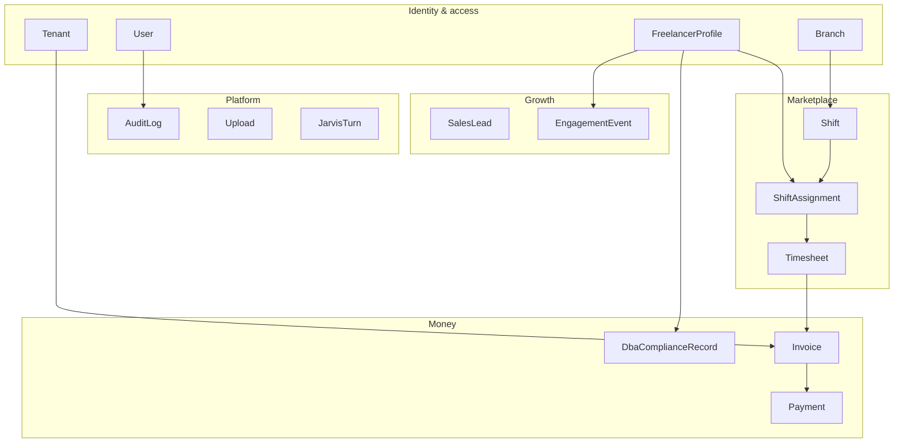
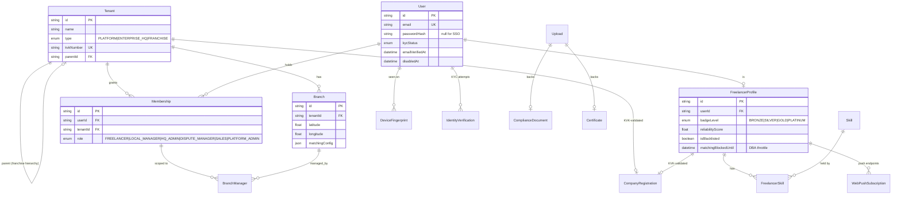
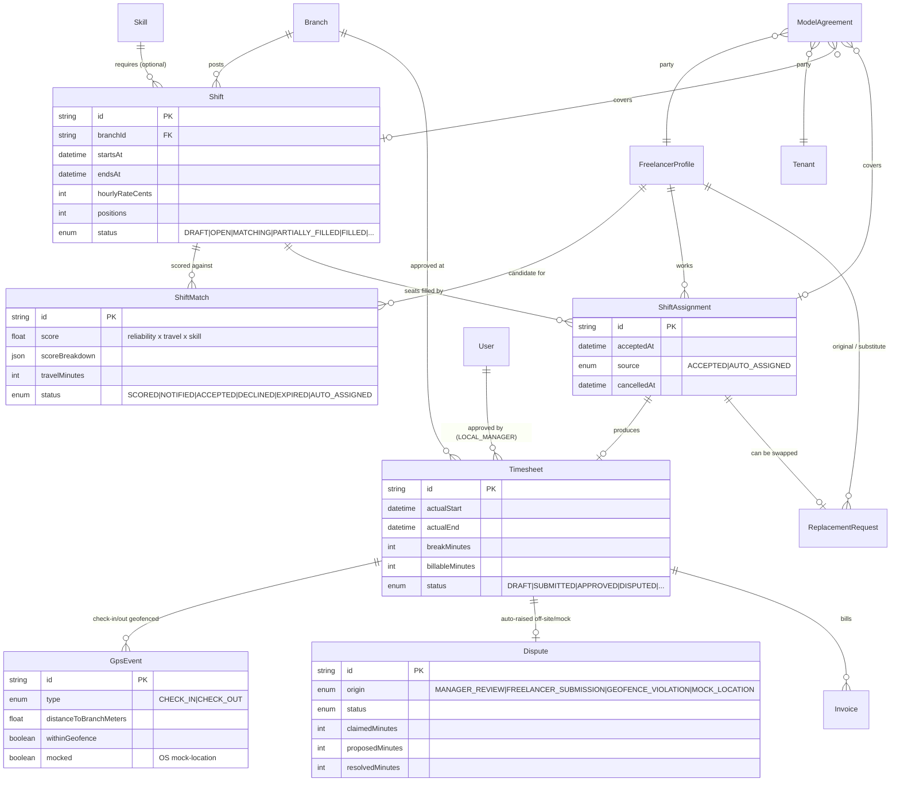
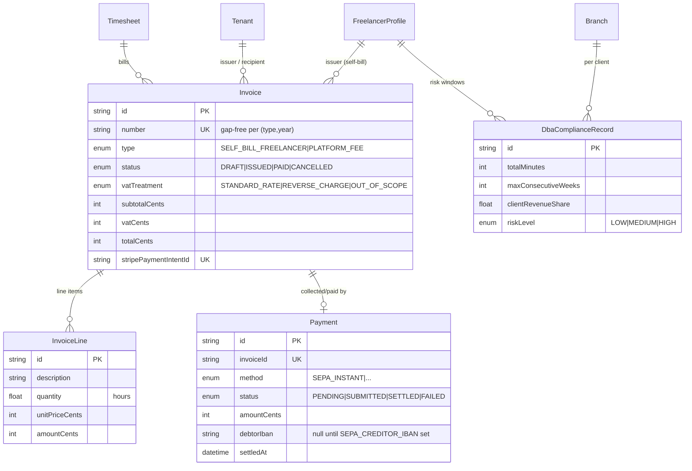
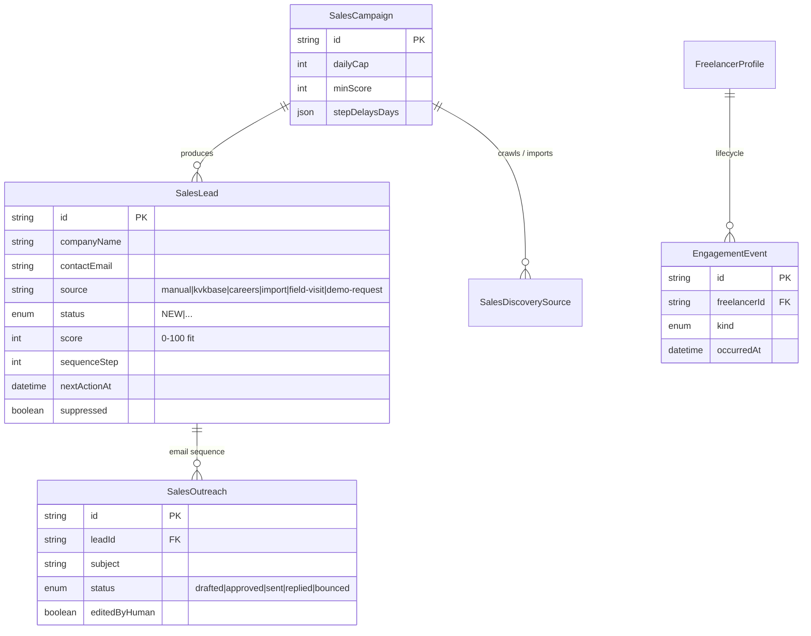
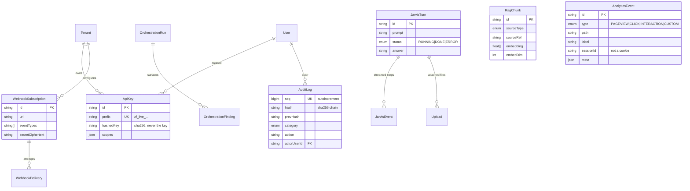

# Data model

`prisma/schema.prisma` — **56 models, 42 enums, one PostgreSQL database**. All
money is integer cents (`Int`), coordinates are `Float` degrees, embeddings are
`Float[]`. Generated view of the relations below; the schema file is the source
of truth.

A full 56-entity ER diagram is unreadable, so it's split by domain. Standalone
tables with no foreign keys (`Counter`, `InvoiceSequence`, `PayrollRunRecord`,
`PayslipRecord`, `PayoutPreference`, `AdvanceRecord`, `SalesSuppression`,
`SalesEngineRun`, `ShopProduct`, `VoiceAnnouncement`, `RagChunk`, `AiUsageLog`,
`KeyValueStore`, `AnalyticsEvent`, `DiditWebhookEvent`, `PasswordResetToken`)
are listed but not drawn.

---

## Domains and their bridges

---

## Identity & access

---

## Marketplace

---

## Money

`InvoiceSequence` (row-locked `(type, year)` counter), `PayrollRunRecord`,
`PayslipRecord`, `PayoutPreference`, `AdvanceRecord` reference their subjects by
string id, no FK — the payroll engine keeps the DB read-only.

---

## Growth

---

## Platform services

---

## Regenerating

There is no ERD generator in the toolchain (sovereign principle: no extra
build deps). To refresh this file after a schema change, re-derive the domain
relation lists from `prisma/schema.prisma` and update the `erDiagram` blocks.
If you want it automated, `prisma-erd-generator` or `prisma-markdown` can be
added as a dev-only generator — both render Mermaid.
